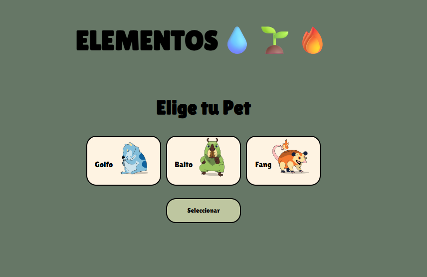
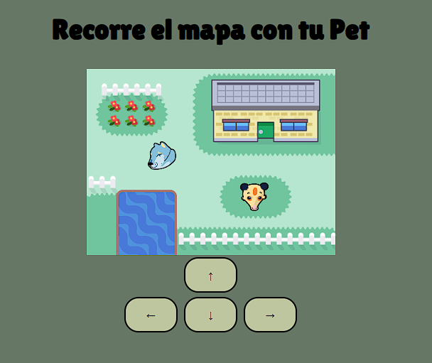
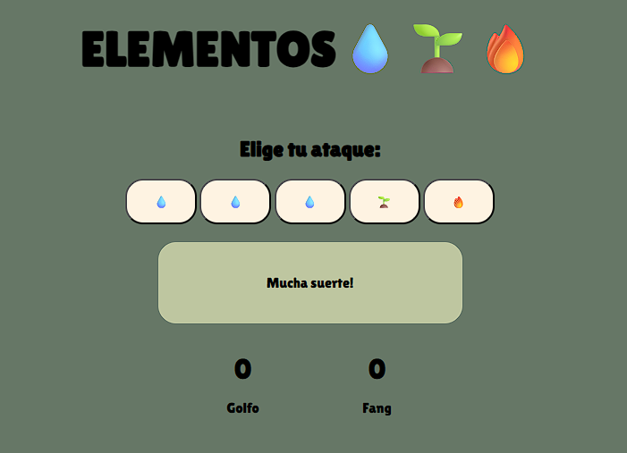

# ELEMENTOS 💧🌱🔥

Juego interactivo sobre los elementos de la tabla periódica. Hecho con HTML, CSS y JavaScript.

## 🎮 ¿Cómo jugar?
Abrí el juego en GitHub Pages 👉 [Jugar ahora](https://wsebastianpds.github.io/elementos-game/)

## 🛠️ Tecnologías usadas
- HTML
- CSS
- JavaScript

## 🧠 Objetivo
Aprender los elementos de la tabla periódica jugando.

## 📸 Captura de pantalla

  
  
  
  

## ✍️ Autor
William Sebastian Pinto Da Silva

