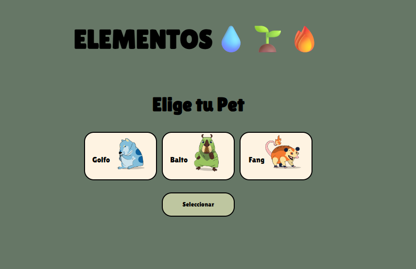
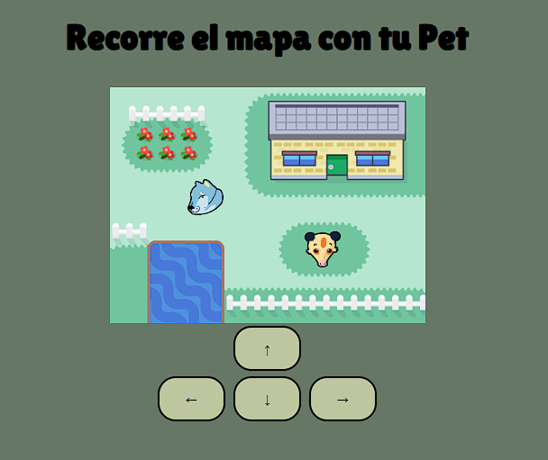
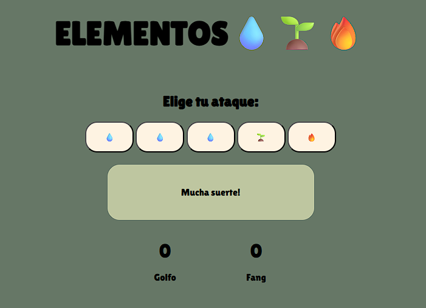
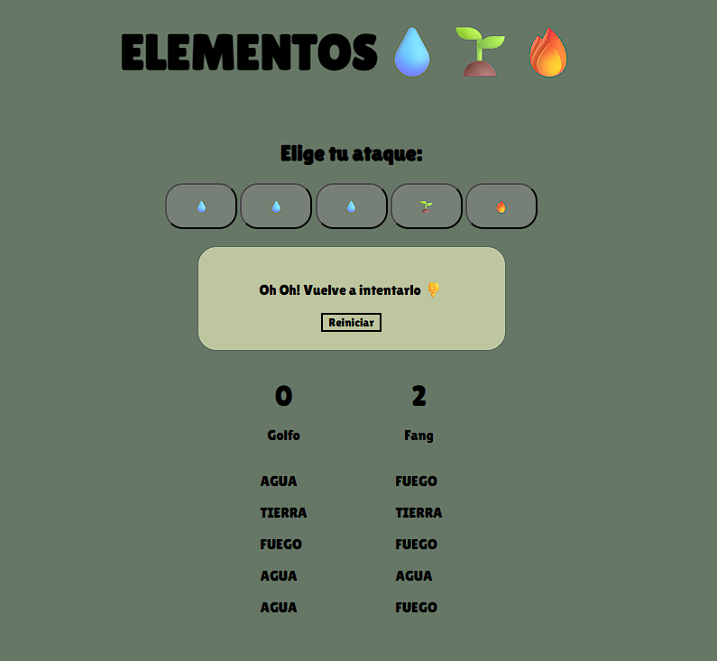

# ELEMENTOS 💧🌱🔥

Juego interactivo educativo basado en los **elementos de la tabla periódica**, desarrollado con **HTML, CSS y JavaScript**.

El proyecto combina aprendizaje y juego, permitiendo reforzar conceptos básicos de química de manera dinámica.

---

## 🎮 Demo

👉 Jugar en GitHub Pages:  
https://wsebastianpds.github.io/elementos-game/

---

## 🧠 Objetivo del proyecto

- Aprender y reforzar conocimientos sobre los elementos de la tabla periódica
- Practicar **lógica en JavaScript**
- Trabajar interacción usuario–interfaz
- Desarrollar un proyecto web completo desde cero

---

## 🕹️ ¿Cómo jugar?

- Interactuá con los distintos elementos
- Explorá sus características
- Avanzá a través de las pantallas del juego

El juego está pensado para ser simple, intuitivo y educativo.

---

## 🛠️ Tecnologías utilizadas

- HTML5
- CSS
- JavaScript
- GitHub Pages

---

## 📂 Estructura del proyecto
/

├── index.html

├── styles.css

├── script.js

├── fotos/

└── README.md

---

## 📸 Captura de pantalla

  
  

  
  

---

## 📌 Estado del proyecto

✔️ Funcional  

✔️ Publicado  

✔️ Proyecto personal de práctica  

---

## ✍️ Autor

**William Sebastian Pinto Da Silva**  
Junior Backend Developer | C# · .NET · SQL | QA Testing

---

> Proyecto personal con fines educativos.
